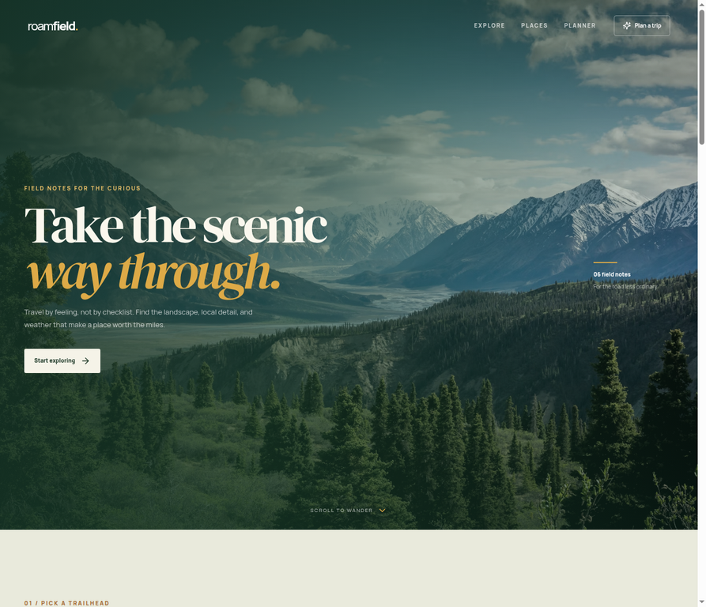

# Roamfield Travel

Roamfield is a nature-journal React travel explorer built for the Designesthetics front-end assignment. It helps visitors browse a focused set of destinations, see current weather, discover notable places, ask a destination-aware AI guide questions, and generate a readable day-by-day itinerary.



## Features

- Looping hero video with a clear landing experience.
- Destination search and region filters.
- Destination detail view with editorial description and key planning facts.
- Famous places presented as image-led cards with context, not a bare name list.
- Browser location permission flow with a graceful denied-permission state.
- Live current weather from Open-Meteo, with loading and error states.
- Destination and place photography loaded from Unsplash image URLs.
- Server-side AI guide for destination questions.
- Server-side structured AI itinerary generation rendered as day-by-day cards.
- Responsive layouts for desktop, tablet, and mobile.
- Keyboard-visible focus states, semantic labels, reduced-motion support, empty states, and request fallbacks.

## Integrations

| Purpose | Integration |
| --- | --- |
| Current weather | [Open-Meteo](https://open-meteo.com/) |
| Destination and place imagery | [Unsplash](https://unsplash.com/) remote image URLs |
| Questions and itinerary generation | Manus built-in LLM proxy (server-side) |
| Hero motion | Remote Pexels video asset |

No API keys are committed. The LLM credential is provided by the WebDev runtime through its server-side integration.

## Run locally

```bash
pnpm install
pnpm dev
```

Open the local Vite/Express preview shown by the dev server. For a production build:

```bash
pnpm check
pnpm build
pnpm start
```

The project is a React + TypeScript + Vite + Tailwind application with the WebDev Express/tRPC server scaffold. Live weather runs through the server procedure in `server/routers.ts`; AI calls also stay on the server so credentials are not exposed to the browser.

## Project structure

- `client/src/pages/Home.tsx` — the complete travel experience and curated destination data.
- `client/src/index.css` — the editorial visual system and responsive styles.
- `server/routers.ts` — weather, destination Q&A, and structured itinerary procedures.
- `client/index.html` — page metadata and application title.
- `server/wayfarer.test.ts` — weather procedure coverage.

## Notes

The included destinations are intentionally curated to keep the assignment experience focused. The app does not require sign-in to explore, check weather, ask the guide, or generate an itinerary.
